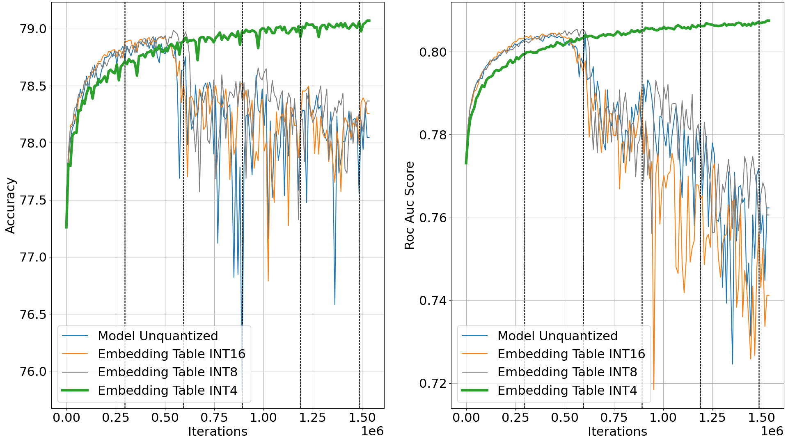
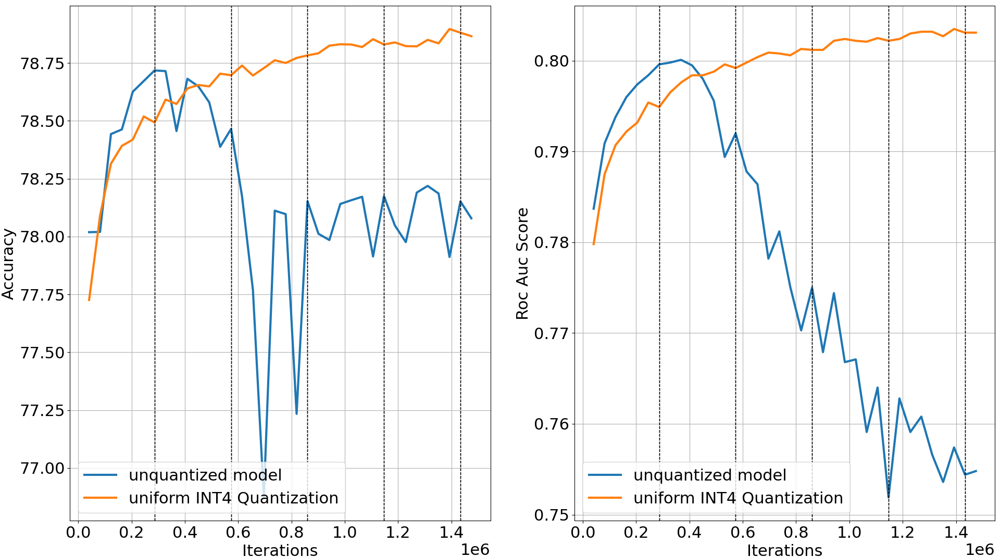
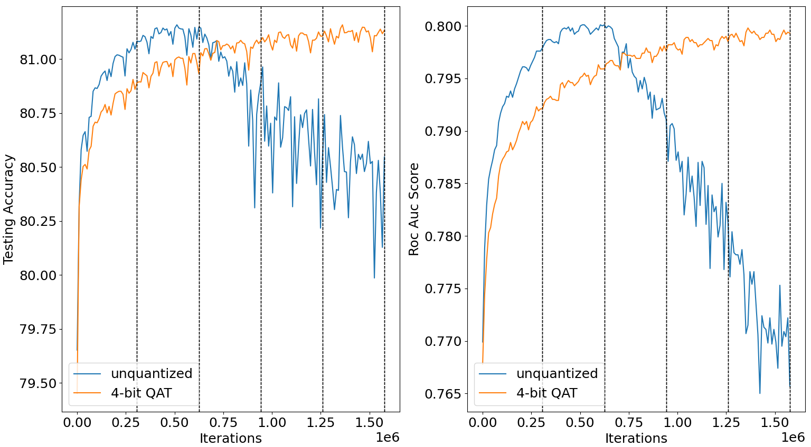
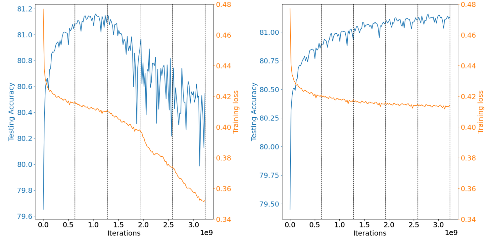
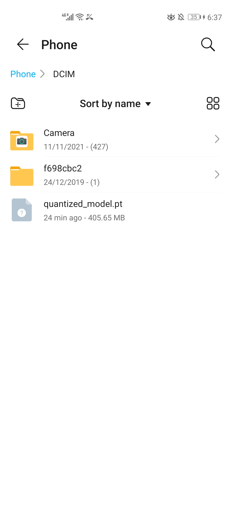
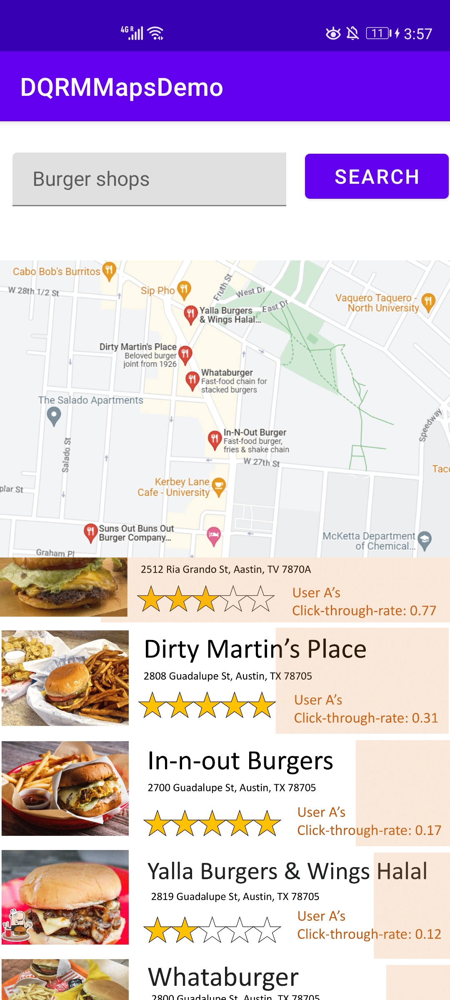

DQRM: Deep Quantized Recommendation Model
=================================================================================
*A recommendation model that is small, powerful and efficient to train* 

## `Please check out our project preprint (anoymous) and Supplemental Materials`
[DQRM paper supplemental materials](./DQRM__Deep_Quantized_Recommender_System_Model.pdf) is here

[DQRM paper in pdf format](./DQRM__Deep_Quantized_Recommender_System_Model.pdf) is now available 
<!-- Project preprint is still in progress, estimated date to be online: Dec 28th, 2022 (estimated hour 13:00 CT).  -->

The project is planned to submit to **RecSys2023**. 

Acknowledgement: 
------------
This repo is built based on the original [DLRM](https://github.com/facebookresearch/dlrm) repo, while the quantization code for embedding tables and linear layers is shared with [HAWQ](https://github.com/Zhen-Dong/HAWQ). 

Description: 
------------
State-of-the-art click through rate recommendation model DLRM is intensively used in the industry environment. However, DLRM has gigantic embedding tables which cause great memory overhead during inference and training. Large embedding tables took up more than 99% of the total parameters in these models, and previous works have shown that these embedding tables are over-parameterized. 

This project shows that large and over-parameterized embedding tables lead to severe overfitting and huge inefficiency in using the training data, as model overfits during second epoch of the training set. Then, the project shows that heavy quantization (uniform INT4 quantization) and quantization-aware training (QAT) can significantly reduce overfitting during training. The quantized model performance even edge against the original unquantized model on Criteo Kaggle Dataset. 

However, naive QAT can lead to inefficiency for recommendation models, exacebating the memory bottleneck during training. We proposed two techniques to improve the naive QAT. Also, DLRM are usually large and trained under distributed environments, we combined quantization and sparsification together to compress the communication. We publish our project as Deep Quantized Recommendation System (DQRM), which is a recommendation system that is small, powerful, and efficient to train. 

Results: 
------------ 

We found that low-precision quantization of embedding tables exhibits strong effect of overfitting reduction. As the results can be better exihit from the following diagrams. We present contrast between low-precision quantization (QAT) versus single-precision (normal training). Experiments conducted using one single Nvidia A5000 GPU. 

 

Below are experiments of DQRM weight quantization results. Please note that all of the statistics reported here are all run under the distributed data parallelism. As mentioned in the paper, accuracies are consistently lower than running on the single node or machine settings. We report single machine accuracies in the paper section 3 for better evaluation of weight quantization performance from DQRM. <span style="color:orange"> *Please refer to the paper for official results, statistics shown here are for reference.* </span> 

Following the observations, we further quantize the MLP layers into INT4. The entire model is then quantized into INT4 uniformly. 

1) [Criteo Kaggle Dataset](https://ailab.criteo.com/ressources/) 


   
Heavily quantized models outperforms the original models by better overcoming overfitting (Criteo Kaggle Dataset)

| Settings    | Model bit width | Training loss | Testing Accuracy | Testing ROC AUC | 
| ----------- | ----------- | ----------- | ----------- | ----------- | 
| baseline      |   FP32     | 0.303685 | 78.718% | 0.8001 | 
| DQRM   | INT4       | 0.436685 | 78.897% | 0.8035 | 

2) [Criteo Terabyte Dataset](https://labs.criteo.com/2013/12/download-terabyte-click-logs/) 


   
Heavily quantized models outperforms the original models by better overcoming overfitting (Criteo Terabyte Dataset)  


   
Original model training loss falls as the model suffers overfitting, comparing with uniform INT4 Quantization-aware Training (QAT) 

| Settings    | Model bit width | Training loss | Testing Accuracy | Testing ROC AUC | 
| ----------- | ----------- | ----------- | ----------- | ----------- | 
| baseline      |   FP32     | 0.347071 | 81.165% | 0.8004 | 
| DQRM   | INT4       | 0.412979 | 81.159% | 0.7998 | 

Android App Demo Screenshot
------------ 
We include a demo of DQRM exported to an Android phone. From the below figures, the tested DQRM model size is 405.65 MB. As a reference, the DLRM Kaggle model size is 2.16 GB. The model size is not strictly 8$\times$ compression because of the following two reasons: 1) Embedding tables can be quantized into INT4, but the embedding vectors have to be bit-packed together into INT8 format to fully benefit from the INT4 low precision. However, bitpacking on PyTorch is tricky and PyTorch 4-bit packing is not fully optimized in terms of performance. 2) PyTorch doesn't support MLP layers to be quantized into bitwidth below INT8. Therefore, MLP layers, although quantized into INT4, still need to be stored as INT8 numbers. Still, we believe this is a first step towards deploying large recommendation models to edge devices so as to alleviate the heavy cloud AI inference pressure. 

 

Also, we built an demo map mobile app to illustrate one possible use of the quantized recommendation model on edge. 

 

Running scripts 
------------
1) Running on GPUs and the Criteo Kaggle Dataset 
```
bash -x ./bash_scripts/Kaggle/run_dlrm_kaggle_gpu_four.sh 
``` 
2) Running on CPU clusters and the Criteo Terabyte Dataset 
<!-- (<span style="color:yellow">only simulation for multi-node available now, *real distributed environment will be online shortly*</span>)  -->
```
bash -x ./bash_scripts/Terabytes/run_dlrm_tb_cpu.sh 
``` 

Requirements
------------
pytorch-nightly (*11/10/20*)

scikit-learn

numpy

onnx (*optional*)

pydot (*optional*)

torchviz (*optional*)

mpi (*optional for distributed backend*)
